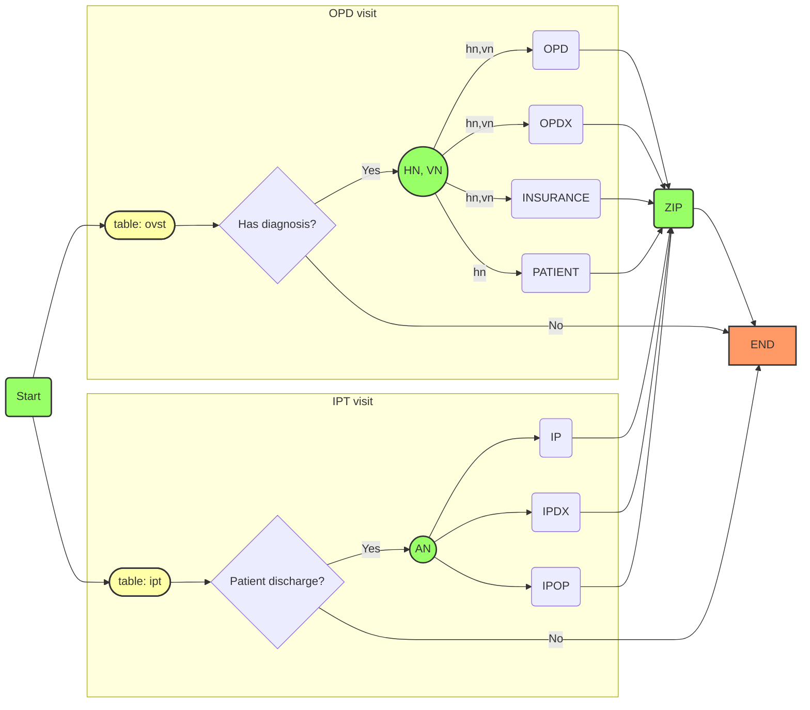

Flow การดึงข้อมูล HOSxP version 3:

```mermaid
flowchart LR
START(Start) --> OVST([table: ovst])
subgraph OPD visit
OVST --> HASDX{Has diagnosis?}
HASDX --> |Yes| HN((HN, VN))
HN --> |hn,vn| OPD(OPD)
HN --> |hn,vn| OPDX(OPDX)
HN --> |hn,vn| INS(INSURANCE)
HN -->|hn| PATIENT(PATIENT)
end

HASDX --> |No| END
START --> IPT([table: ipt])

subgraph IPT visit
IPT --> DISCHARGE{Patient discharge?}
DISCHARGE --> |Yes| AN((AN))
AN --> IP(IP)
AN --> IPDX(IPDX)
AN --> IPOP(IPOP)
end
DISCHARGE --> |No| END

PATIENT --> ZIP(ZIP) 
OPD --> ZIP
OPDX --> ZIP
INS --> ZIP

IPDX --> ZIP
IPOP --> ZIP
IP --> ZIP

ZIP --> END

classDef green fill:#9f6,stroke:#333,stroke-width:2px;
classDef orange fill:#f96,stroke:#333,stroke-width:2px;
classDef yellow fill:#ffffa8,stroke:#333,stroke-width:2px;

class START,ZIP,HN,AN green
class END orange
class OVST,IPT yellow
```
